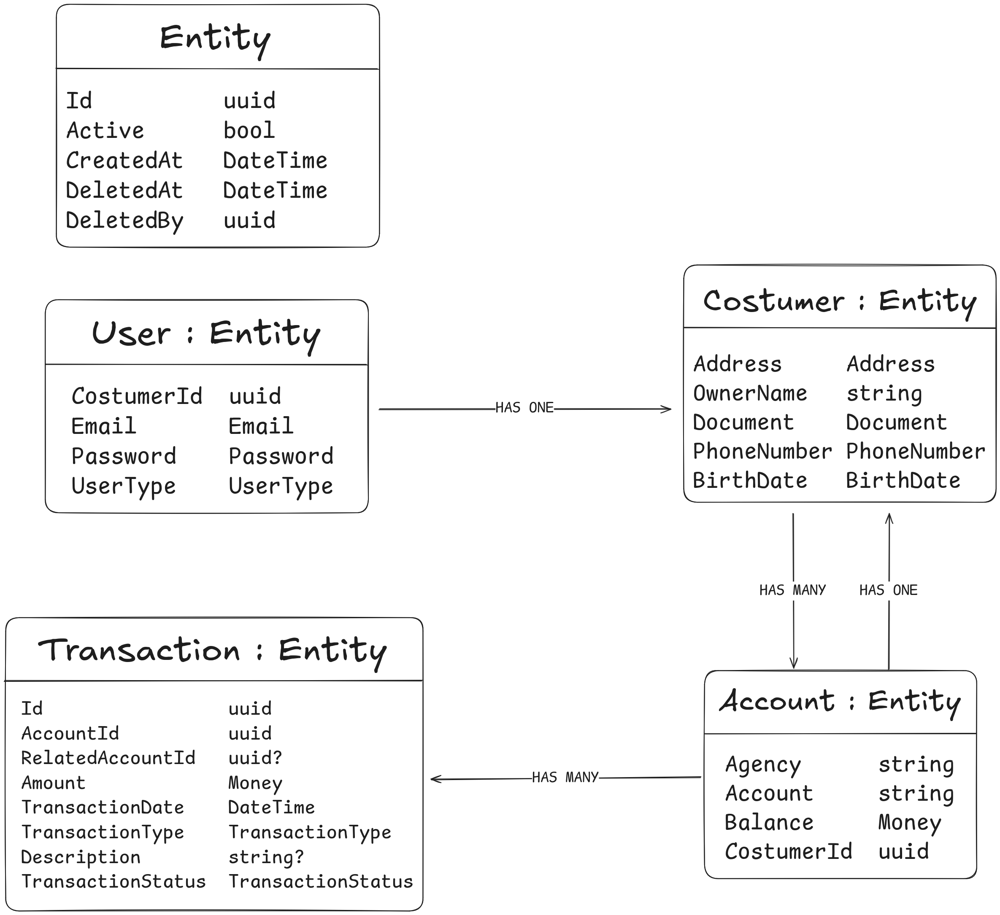

# ADR 002: Refinamento do Modelo de Domínio: Separação de Customer, User e Account, e Generalização de Entidades

---

**Título: _Refinamento do Modelo de Domínio: Separação de Customer, User e Account, e Generalização de Entidades_**

**Status: _Aceita_**

**Data: _26 de junho de 2025_**

---

## Contexto:
Após a definição da modelagem inicial [(ADR 001)](./0001-initial-domain-modeling.md) para as entidades Account e Transaction e seus Value Objects, identifiquei oportunidades de refinamento no modelo de domínio. As preocupações surgiram em relação à responsabilidade da Account (que originalmente continha dados de senha e titular), à flexibilidade para cenários futuros (como múltiplas contas por usuário, múltiplos usuários por cliente, ou dados pessoais do cliente independentes de login), e à necessidade de padronizar campos de auditoria em todas as entidades.

Assim eram as classes Account e Transaction, anteriormente:

```cs
public class Account
{
   public Guid      Id        { get; private set; }
   public string    OwnerName { get; private set; }
   public Money     Balance   { get; private set; }
   public Document  Document  { get; private set; }
   public BirthDate BirthDate { get; private set; }
   public Password  Password  { get; private set; }

   // construtor, funcoes auxiliares, etc.
}
```

```cs
public class Transaction
{
   public Guid            Id               { get; }
   public Guid            AccountId        { get; }
   public Guid?           RelatedAccountId { get; }
   public Money           Amount           { get; }
   public DateTime        TransactionDate  { get; }
   public TransactionType TransactionType  { get; }
   public string?         Description      { get; }

   // construtor, funcoes auxiliares, etc.
}
```

## Decisão:

Decidi refatorar o modelo de domínio para introduzir uma entidade Customer separada, consolidar os dados de login em uma entidade User dedicada, e estabelecer uma entidade base Entity para campos de auditoria e controle de ciclo de vida. O diagrama de classes seguido:



### Fluxo de Autenticação e Seleção de Conta:

- **Autenticação**: O usuário faz login com credenciais (Email, Password) do User.
- **Identificação** do Cliente: Após a autenticação bem-sucedida, o sistema recupera o CustomerId associado a esse User.
- **Listagem de Contas**: O sistema consulta todas as Accounts que possuem esse CustomerId.
- **Seleção**: O frontend apresentaria a lista de Accounts (identificadas por AccountNumber e Agency) para o usuário selecionar.
- **Operações**: Operações subsequentes na conta requerem o AccountId da conta selecionada.