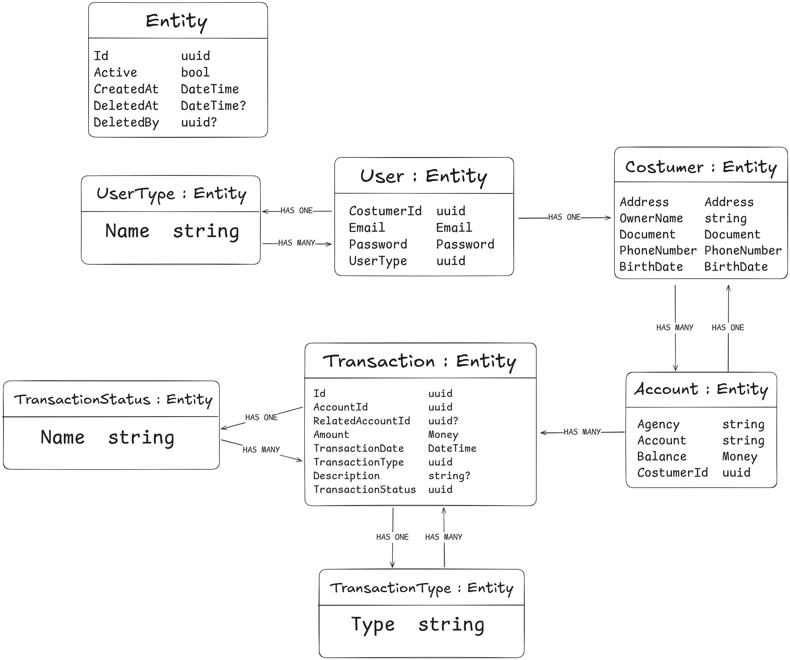

# ADR 003: Transição de Enums para Entidades de Lookup (Tabelas de Referência)

**Título: _Transição de Enums para Entidades de Lookup (Tabelas de Referência)_**

**Status: _Aceita_**

**Data: _27 de junho de 2025_**

## Contexto:

No desenvolvimento do meu modelo de domínio, inicialmente utilizei enums para categorizar tipos e status importantes, como UserType, TransactionType e TransactionStatus. Essa abordagem simplifica o código e fornece segurança de tipo. No entanto, após discussões e análises sobre a flexibilidade e escalabilidade do sistema bancário, especialmente no que tange à necessidade de adicionar ou modificar esses tipos/status sem recompilação do código, a limitação dos enums se tornou evidente.

## Decisão:

Decidi migrar todos os enums que representam categorias ou status de entidades (UserType, TransactionType, TransactionStatus) para entidades de domínio separadas (lookup tables ou tabelas de referência) no banco de dados.

## Novo diagrama de classes:
